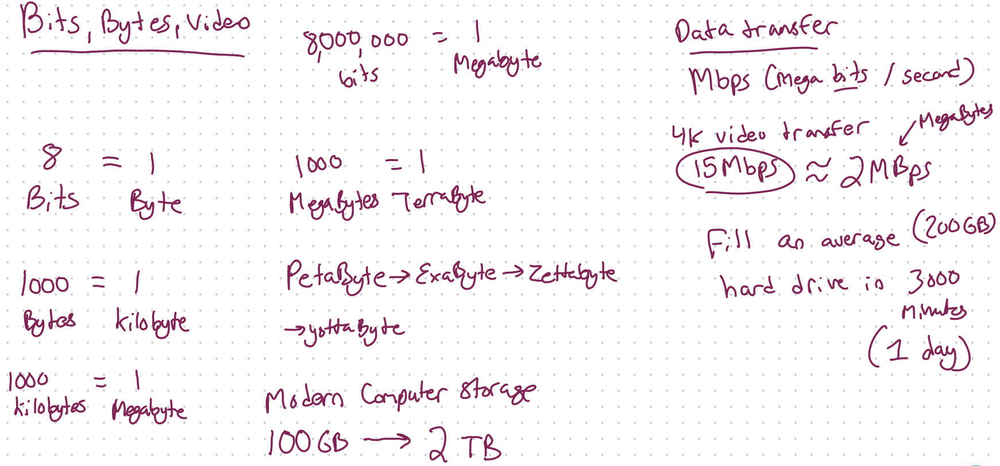

# Bits vs Bytes AND Video Streaming

> Data is stored digitally as a series of bits. Each bit represents a binary value, either 0 or 1. From there, we scale up to larger units:

| Unit | Equivalent | Description |
|------|------------|-------------|
| Bit (b) | 1 bit | Basic unit of information in computing. Represents a binary digit, taking a value of either 0 or 1. |
| Byte (B) | 8 bits | A byte can represent 256 different values (2^8). |
| Kilobyte (KB) | 1024 bytes | Often used to refer to file sizes or storage capacities. |
| Megabyte (MB) | 1024 kilobytes | Often used to refer to file sizes or storage capacities. |
| Gigabyte (GB) | 1024 megabytes | Commonly used to refer to storage capacity of devices. |
| Terabyte (TB) | 1024 gigabytes | Used for larger storage devices or cloud storage services. |
| Petabyte (PB) | 1024 terabytes | Used for very large storage capacities, like data centers. |
| Exabyte (EB) | 1024 petabytes | Mainly used for aggregated data, like global internet traffic per month. |
| Zettabyte (ZB) | 1024 exabytes | Used in contexts of extremely large data scale, such as data generated globally in a year. |
| Yottabyte (YB) | 1024 zettabytes | Currently theoretical in the context of computer storage, as no system exists with such capacity. |

> When we're talking about data transfer rates, like streaming video or networking, we usually measure in bits per second (bps), not bytes. This is because data transmission has historically been measured in signal changes over time, which matches nicely with a bit-based rate. For example, if you have an internet connection speed of 50 Mbps, that means you can receive up to 50 million bits per second.

| Video Quality | Required Bandwidth |
|---------------|--------------------|
| SD (480p)     | 1 - 2.5 Mbps       |
| HD (720p)     | 2.5 - 4 Mbps       |
| HD (1080p)    | 4 - 5 Mbps         |
| Ultra HD (4K) | 15 - 25 Mbps       |

> Note: The actual bandwidth required can depend on various factors including the codec used, frame rate, color depth, and more.

For network data transfer, it's common to see speeds referenced in Mbps (Megabits per second), Gbps (Gigabits per second), or even Tbps (Terabits per second), especially when referring to total bandwidth of an ISP or in data centers. 

Remember, when dealing with data transfer rates, 1 byte = 8 bits. So, if you want to convert from bits to bytes, divide by 8. If you want to convert from bytes to bits, multiply by 8. This is an important distinction when calculating how quickly a file will download/upload or how much data you can stream.

> Mbps stands for "Megabits per second", not "Megabytes per second". The terms sound similar but they represent different amounts of data.

1 Byte is equal to 8 Bits, so if you have a speed of 1 Mbps (Megabit per second), that's equivalent to 0.125 MBps (Megabytes per second).

To convert from Mbps to MBps, you would divide by 8. So, if you have an internet connection speed of 100 Mbps, that's equivalent to 12.5 MBps.

Similarly, to convert from MBps to Mbps, you would multiply by 8. So, if you were downloading at a rate of 5 MBps, that's equivalent to 40 Mbps.

> 1 million bits (or 1 Megabit) is equivalent to 0.125 Megabytes. This distinction is important to keep in mind, especially when dealing with internet connection speeds or data transfer rates.

The "M" in Mbps stands for "Mega," which in the context of digital information means 1,048,576 (or 2^20). So, 1 Megabit is equal to 1,048,576 bits. 

However, in many contexts including network speeds, "Mega" is often casually interpreted as one million for simplicity in mental calculations and communication. Technically, though, it represents 1,048,576. 

This discrepancy arises from the fact that digital data is based on binary (base 2), but we often discuss and interpret it in a decimal context (base 10). 

In the International System of Units (SI), "mega-" is a prefix meaning one million (1,000,000 or 10^6). But in the binary system used by computers, it's more convenient to use powers of two. The closest power of two to a million is 2^20, which equals 1,048,576, and this is why "mega-" means 1,048,576 in the context of computer memory or data storage. 

For example, when we say a 1 MB (Megabyte) file, we're actually referring to a file that is 1,048,576 bytes in size. But when referring to network speeds, 1 Mbps (Megabit per second) is often simplified to mean 1 million bits per second, although its true value in a binary context would be 1,048,576 bits per second. 

This can certainly get a bit confusing, but it's a result of trying to merge the binary world of computers with our everyday decimal-based understanding.

For example, if you have an Internet connection with a download speed of 8 Mbps, this means you can theoretically download at a rate of 1 Megabyte per second (1 MBps).

However, keep in mind that many factors can affect the actual data transfer rate, including network congestion, the quality of your Internet connection, the server from which you're downloading, and so on. So you might not always see download speeds that perfectly match the theoretical maximum based on your connection speed.

The file size of a video depends on various factors including the bitrate, frame rate, and codec used for compression. For a standard quality 720p video, you might expect a bitrate of around 2-4 Mbps. However, this can vary significantly depending on the specific encoding settings and the content of the video itself.
If we use an average bitrate of 3 Mbps as a baseline for a 720p video, and we want to calculate the size of a 5 minute video:
3 Mbps = 0.375 Megabytes per second (remember, to convert from Megabits to Megabytes, divide by 8).

A 5 minute video is 300 seconds, so:
0.375 MBps * 300 seconds = 112.5 Megabytes
So, a 5 minute 720p video encoded at an average bitrate of 3 Mbps would be approximately 112.5 Megabytes.
Again, it's important to note that the actual file size could be somewhat larger or smaller depending on the specifics of the video encoding, including the codec used, the frame rate, the amount of motion in the video, and so on.

## Encoding a video 
Encoding a video is the process of converting raw video data into a digital format that can be easily stored, transmitted, and played back. This process involves applying a codec (compressor-decompressor) to the video data to reduce its size while maintaining acceptable quality. The encoded video can then be stored as a video file or streamed over a network.

Here are the main steps in the encoding process:

1. **Capture**: Video is captured, typically as a series of images (frames).

2. **Compression**: The video data is compressed to reduce its size. This can involve both spatial compression (reducing detail within each individual frame) and temporal compression (reducing detail between different frames).

3. **Encoding**: The compressed data is encoded into a digital format. This involves converting the video data into a series of binary values that can be easily stored and transmitted.

4. **Storage/Transmission**: The encoded video is then either stored as a video file or transmitted over a network for streaming.

## bitrate

Bitrate refers to the amount of data processed per unit of time in a video, typically measured in kilobits or megabits per second (Kbps or Mbps). 

The bitrate directly affects the video quality and the file size. A higher bitrate means each second of video contains more data, which usually results in higher video quality because more data can represent more detailed images. However, a higher bitrate also means a larger file size and more bandwidth required for streaming.

You can adjust the bitrate when encoding a video. A high bitrate will result in better video quality but a larger file size. Conversely, a low bitrate will yield a smaller file size, but the video quality may be poorer, particularly in scenes with a lot of motion.

It's important to find a balance between video quality and file size/bandwidth that's appropriate for your specific needs. For example, if you're streaming video over the internet, you might need to use a lower bitrate to ensure smooth playback, particularly for users with slower internet connections. But if you're storing video locally and have plenty of storage space, you might choose a higher bitrate to maximize video quality.

It's also worth noting that modern video codecs like H.264 and H.265 use variable bit rate (VBR) encoding, which can adjust the bitrate dynamically based on the complexity of each part of the video. This allows these codecs to maintain high video quality while minimizing file size.

